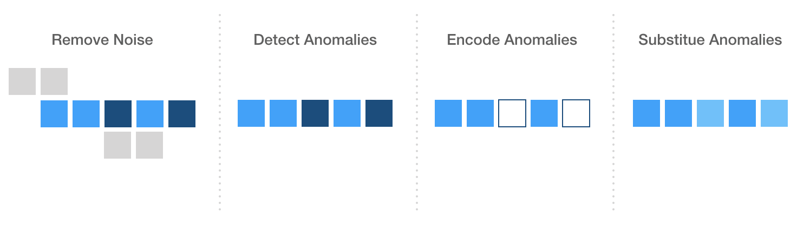

# Machine Learning Engineer Nanodegree
## Capstone Proposal
Carlos Rodriguez
June 22nd, 2019

## Proposal

### Domain Background

Today, unearthing a rare audio archive can be as simple as accessing a popular video sharing platform from a device that fits in your pocket. Alternatively, the fidelity of these aging recordings seemingly remains frozen in the time in which they were captured. Often, important (and even critical) portions of these recordings are unintelligible and are lost to history.

The goal of this capstone is to experiment with using [imputation](https://en.wikipedia.org/wiki/Imputation_(statistics)) algorithms to restore portions of audio content that were recorded poorly or were lost due to degradation.

### Problem Statement

Restoring or repairing audio is challenging for many reasons. There are some inherent challenges with working audio including but not limited to:

- Isolation of the desired source signal
- Identifying and removing noise
- Partial or complete loss of data during recording or due to degradation

Restoring lost audio data is particularly problematic because the audio is generally not missing from the signal, but unintelligible for the listener. This solution would treat unintelligible audio as anomalous and explicitly encode some data points as missing data (null values). An imputation algorithm would then replace the missing data with a plausible replacement similar to its neighbors.

### Datasets and Inputs

The solution will be applied to two crude recordings that have distinguishable audio loss. Additionally, each selection has significant background noise, distortion, and some crosstalk. The content in the audio is of orations that were originally recorded in 1963 and ~1985 respectively.  

In both cases, the audio was extracted from YouTube videos using a tool that converts video to an audio-only format. For each, only small distinct sample will be used as an input.

*Speech given by James Baldwin*
  - ["Free and Brave" a speech by James Baldwin 1963](https://www.youtube.com/watch?v=EMYgOfcgMaI)

*Interview given by Hector Lavoe*
  - [HECTOR LAVOE - AUDIO RAREZA 2.wmv](https://www.youtube.com/watch?v=ICvmLoBPX4o&t=40s)

The goal of using two inputs is to validate that the technique can work generally across audio signals with similar characteristics.

### Solution Statement

This solution treats unintelligible audio as anomalous and explicitly encodes the data point as missing data (null value). An imputation algorithm will then replace the missing data point inserting a plausible value that is similar to its neighbors.

Noise and unwanted signal sources are cleaned as part of pre-processing. Any desired source audio that is audibly diminished during pre-processing is also replaced.

### Benchmark Model

As a benchmark, the outputs will be compared to a high-fidelity digital recording. The benchmark, when analyzed, should not present any noise or anomalies which is ultimately the goal of the solution.

*Interview with Barack Obama*

- [Barack Obama discusses dancing on David Letterman's new Netflix show](https://www.youtube.com/watch?v=SPCYaMmPnIQ)

### Evaluation Metrics

To evaluate, the solution will measure the mean Silhouette Coefficient (silhouette score). The output data should reflect an optimal value for `n_clusters` that is relatively small.  Since a silhouette analysis can be ambivalent in deciding between 2 and 4 clusters (1), the solution should also evaluate the size of the individual clusters.

Larger sized clusters should represent the desired source audio, while smaller clusters should represent naturally occurring noise and/or other less significant source audio.

### Project Design

In theory, the solution should sequentially accomplish these overarching tasks:

I. Noise removal with FFTT and/or DBSCAN
  - Fast Fourier Transform noise reduction could potentially aide in removal of typical and expected noise frequencies.

  - DBSCAN might be a better overall solution because it may protect sections that are candidates for substitution.

   Points that are generally unreachable  from other points can be considered noise and can cleaned from the dataset. The threshold for noise should be high so as not to inadvertently remove data that can be substituted.

II. Anomaly Detection with DBSCAN
  - For the purpose of this solution, anomalies should be distinguishable from noise. Anomalous data points should display more connectedness to points that represent the desired source audio.

  To make this distinction, anomalous sections may require a separate analysis using audio-specific characteristics like Fourier properties.

III. Encoding of anomalous points as missing data, temporarily substituting with `None`

  - Once Identified, the solution will treat anomalies as missing data simply by replacing those points with null values (intended to resemble missing values in a structured data set).

IV. Replace missing data points leveraging K-Nearest Neighbors

  - The solution will then attempt to replace the missing values with statistically similar values as predicted using **KNN**.

  > "The assumption behind using KNN for missing values is that a point value can be approximated by the values of the points that are closest to it, based on other variables." (2)

**References**

1. https://scikit-learn.org/stable/auto_examples/cluster/plot_kmeans_silhouette_analysis.html

1. https://towardsdatascience.com/the-use-of-knn-for-missing-values-cf33d935c637

-----------
